# 🎓 Tutorial ManyBlack Studio
*Guia Completo para a Equipe Operacional - Atualizado com Novas Funcionalidades*

---

## 📖 Índice

1. [Primeiros Passos](#-primeiros-passos)
2. [🏠 Dashboard - Visão Geral](#-dashboard---visão-geral)
3. [🔄 Procedimentos - Criando Funis](#-procedimentos---criando-funis)
4. [⚡ Automações - Mensagens Automáticas](#-automações---mensagens-automáticas)
5. [🎯 Intake & Âncoras - Capturando Intenções](#-intake--âncoras---capturando-intenções)
6. [🧪 Simulador - Testando Conversas](#-simulador---testando-conversas)
7. [🚀 Publicação - Enviando para Produção](#-publicação---enviando-para-produção)
8. [🆕 Novas Funcionalidades](#-novas-funcionalidades)
9. [💡 Dicas e Boas Práticas](#-dicas-e-boas-práticas)

---

## 🚀 Primeiros Passos

### Como Acessar o Sistema

1. **Abra seu navegador** e acesse: `http://localhost:5173`
2. **Verifique se o backend está rodando** - deve aparecer "Sistema Saudável" no dashboard
3. **Explore o modo escuro** - clique no ícone da lua no canto superior direito

### Interface Principal

- **📱 Sidebar à esquerda**: Navegação entre as páginas
- **🌙 Botão de tema**: Alterna entre modo claro e escuro
- **📦 Blocos colapsáveis**: Clique para expandir/contrair seções
- **⚙️ Botões de ação**: Sempre visíveis nos cantos dos blocos

---

## 🏠 Dashboard - Visão Geral

O **Dashboard** é sua central de controle. Aqui você vê o "pulso" do sistema em tempo real.

### O que você encontra:

#### 📊 Cards de Estatísticas
- **Leads Ativos**: Quantas pessoas estão sendo atendidas agora
- **Mensagens/Hora**: Velocidade de resposta do sistema
- **Taxa de Conversão**: % de leads que completaram algum funil
- **Tempo Médio**: Quanto tempo demora para um lead ser atendido

#### 🔍 Saúde do Sistema
- **Verde**: Tudo funcionando perfeitamente
- **Vermelho**: Algo está com problema (chame o time técnico)

#### 🎯 Ações Rápidas
- **Criar Procedimento**: Botão para criar um novo funil
- **Testar Conversa**: Acesso direto ao simulador
- **Ver Relatórios**: Estatísticas detalhadas

### ✅ Exemplo Prático
*"João entra no sistema às 14h. No dashboard, vejo que temos 12 leads ativos e taxa de conversão de 85%. Está tudo funcionando bem!"*

---

## 🔄 Procedimentos - Criando Funis

**Procedimentos** são como "receitas" que o robô segue para guiar cada lead até o objetivo final.

### 🎯 Conceito Principal
Imagine um funil de vendas tradicional, mas automatizado. Cada **passo** do procedimento verifica se o lead cumpriu uma condição. Se não, o robô executa uma ação para ajudar.

### 📋 Como Funciona na Prática

#### Estrutura de um Procedimento:
1. **Título**: Ex: "Liberar acesso ao teste"
2. **Descrição**: O que este procedimento faz
3. **Passos**: Lista ordenada de verificações
4. **Configurações**: Tempo limite e cooldown

#### 🔧 Criando um Novo Procedimento

**Passo 1: Informações Básicas**
- **Nome**: Use algo descritivo como "Onboarding para novos leads"
- **Descrição**: Explique em 1-2 frases o objetivo

**Passo 2: Definir os Passos**
Cada passo tem:
- **Nome do passo**: Ex: "Lead concordou em depositar"
- **Condição**: Como verificar (em português natural)
- **Se não satisfeito**: Qual automação executar

### ✅ Exemplo Real - "Liberar Teste do Robô"

```
Passo 1: "Concorda em depositar"
Condição: "o lead concordou em depositar ou já depositou"
Se não: Executar automação "ask_deposit_for_test"

Passo 2: "Tem conta"
Condição: "tem conta em alguma corretora suportada"
Se não: Executar automação "signup_link"

Passo 3: "Depósito confirmado"
Condição: "depósito confirmado"
Se não: Executar automação "prompt_deposit"

Passo 4: "Liberar acesso"
Condição: "todas as etapas anteriores cumpridas"
Ação: Executar automação "trial_unlock"
```

### 🎛️ Usando a Interface

1. **Clique em "Criar Procedimento"**
2. **Preencha o formulário** com as informações básicas
3. **Adicione passos um por um** usando o botão "+"
4. **Use o simulador** para testar antes de publicar
5. **Salve como rascunho** ou **publique** quando estiver pronto

### 💡 Dicas Importantes
- **Sempre teste no simulador primeiro**
- **Use linguagem natural nas condições** (ex: "lead tem mais de 18 anos")
- **Configure timeouts** para evitar leads "presos"
- **Mantenha procedimentos simples** - máximo 5-6 passos

---

## ⚡ Automações - Mensagens Automáticas

**Automações** são as mensagens que o robô envia automaticamente. Cada automação é uma "resposta inteligente" para uma situação específica.

### 🎯 Quando Usar Automações

- **Perguntas frequentes**: "Como funciona o robô?"
- **Solicitações de ação**: "Faça um depósito para continuar"
- **Confirmações**: "Parabéns! Seu acesso foi liberado"
- **Direcionamentos**: "Clique aqui para criar sua conta"

### 📝 Anatomia de uma Automação

#### Informações Básicas:
- **ID**: Nome único (ex: `ask_deposit_for_test`)
- **Tópico**: Categoria (ex: "teste", "conta", "depósito")
- **Elegibilidade**: Quando usar esta automação
- **Prioridade**: 0.0 a 1.0 (1.0 = máxima prioridade)

#### Conteúdo da Mensagem:
- **Texto**: A mensagem que será enviada
- **Botões** (opcional): Ações que o lead pode clicar
- **Cooldown**: Tempo entre execuções

### ✅ Exemplo Real - Pedindo Depósito

```
ID: ask_deposit_for_test
Tópico: teste
Elegibilidade: "não concordou em depositar e não depositou"
Prioridade: 0.85

Mensagem:
"Para liberar o teste, você consegue fazer um pequeno depósito? 💰"

Botões:
[Sim, consigo] → Marca "agreements.can_deposit = true"
[Como deposito?] → Abre link de ajuda
```

### 🎛️ Criando uma Nova Automação

**Passo 1: Configuração Básica**
1. **ID único**: Use formato `acao_contexto` (ex: `explain_robot_benefits`)
2. **Tópico**: Escolha entre: teste, conta, depósito, suporte, etc.
3. **Prioridade**: 
   - 0.9-1.0: Urgente (ex: liberação de acesso)
   - 0.7-0.8: Importante (ex: criar conta)
   - 0.5-0.6: Informativa (ex: explicar benefícios)

**Passo 2: Elegibilidade (Muito Importante!)**
Escreva em português natural **quando** esta automação deve ser usada:
- ✅ Bom: "lead não tem conta e quer fazer teste"
- ✅ Bom: "já depositou mas ainda não criou conta"
- ❌ Ruim: "novo lead" (muito vago)

**Passo 3: Conteúdo da Mensagem**
- **Use emoji** para deixar mais amigável 😊
- **Seja direto** - máximo 2-3 frases
- **Inclua call-to-action** claro

**Passo 4: Botões (Se Necessário)**
Tipos de botão:
- **Callback**: Atualiza informações do lead
- **URL**: Abre um link externo
- **Procedure**: Inicia um procedimento

### 💡 Dicas para Boas Automações
- **Teste sempre no simulador** com diferentes cenários
- **Use cooldown** para evitar spam (mínimo 2h)
- **Mantenha mensagens curtas** e objetivas
- **Crie botões úteis** que realmente ajudem o lead

---

## 🎯 Intake & Âncoras - Capturando Intenções

O **Intake** é o "cérebro" que entende o que o lead está querendo. As **âncoras** são palavras-chave que ajudam a identificar a intenção.

### 🧠 Como Funciona o Intake

1. **Lead envia mensagem**: "Oi, quero saber sobre o robô"
2. **Intake analisa**: Identifica palavras como "robô", "quero saber"
3. **Classifica intenção**: "Dúvida sobre o produto"
4. **Orquestrador decide**: Busca automação apropriada
5. **Resposta enviada**: Explicação sobre o robô

### ⚙️ Configurações do Intake

#### 🎚️ Precisão vs. Custo
- **Slider esquerda (econômico)**: Mais rápido, menos preciso
- **Slider direita (preciso)**: Mais lento, mais assertivo
- **Recomendado**: Posição 75% para bom equilíbrio

#### 🔍 Palavras de Intenção
Adicione palavras que indicam que o lead quer algo específico:
- **Teste**: "teste", "testar", "experimentar", "demo"
- **Conta**: "conta", "cadastro", "registrar", "criar"
- **Depósito**: "depositar", "transferir", "investir", "aplicar"
- **Suporte**: "ajuda", "problema", "dúvida", "socorro"

#### 🆔 Identificadores de Conta
Padrões que identificam IDs de contas:
- **Quotex**: `\b[a-zA-Z0-9]{6,16}\b` (alfanumérico, 6-16 caracteres)
- **IQ Option**: `\b\d{8,12}\b` (apenas números, 8-12 dígitos)
- **Email**: `[a-zA-Z0-9._%+-]+@[a-zA-Z0-9.-]+\.[a-zA-Z]{2,}`

### 📊 Métricas de Performance

Monitor importante para acompanhar:
- **Taxa de Acerto**: % de intenções identificadas corretamente
- **Tempo Médio**: Quanto demora para processar
- **Falsos Positivos**: Quando identifica errado
- **Falsos Negativos**: Quando não identifica

### ✅ Exemplo de Configuração Intake

```
Precisão vs. Custo: 75%

Palavras de Intenção:
- Teste: teste, testar, demo, experimentar, prova
- Conta: conta, cadastro, registro, criar conta
- Depósito: depositar, investir, aplicar, transferir
- Dúvida: dúvida, ajuda, como, quando, onde

Identificadores:
- Quotex ID: \b[a-zA-Z0-9]{6,16}\b
- Email: [\w\.-]+@[\w\.-]+\.\w+
```

### 💡 Dicas para Otimizar o Intake
- **Monitore as métricas** semanalmente
- **Adicione palavras novas** conforme identifica padrões
- **Teste diferentes configurações** no simulador
- **Ajuste a precisão** baseado no volume vs. qualidade

---

## 🧪 Simulador - Testando Conversas

O **Simulador** é seu ambiente de testes. Aqui você pode simular conversas reais **antes** de publicar qualquer mudança.

### 🎯 Por que Usar o Simulador

- **Evita erros em produção**: Teste antes que leads reais vejam
- **Valida fluxos completos**: Do primeiro contato até a conversão
- **Testa cenários extremos**: E se o lead fizer algo inesperado?
- **Modo desenvolvedor**: Veja logs técnicos detalhados

### 🎮 Como Usar

#### Iniciando uma Simulação

1. **Vá para "Simulador"** no menu lateral
2. **Escolha um cenário**:
   - Novo lead (primeira interação)
   - Lead existente (continuar conversa)
   - Cenário específico (ex: "lead com conta mas sem depósito")

3. **Configure o perfil do lead**:
   - Tem conta? Em qual corretora?
   - Já depositou? Quanto?
   - Concordou com termos?
   - Histórico de interações

#### Durante a Simulação

- **Digite mensagens** como se fosse o lead
- **Veja as respostas** do robô em tempo real
- **Clique nos botões** para testar ações
- **Acompanhe o progresso** nos procedimentos

#### 🛠️ Modo Desenvolvedor

Ative para ver informações técnicas:
- **Logs de processamento**: Como o Intake analisou a mensagem
- **Fatos identificados**: O que o sistema "entendeu"
- **Automações consideradas**: Quais foram avaliadas
- **Decisão do orquestrador**: Por que escolheu X em vez de Y

### ✅ Cenários de Teste Recomendados

#### 1. Lead Novo Interessado
```
Mensagem: "Oi, quero saber sobre o robô"
Esperado: Explicação do robô + pergunta sobre teste
```

#### 2. Lead Quer Testar
```
Mensagem: "Quero testar o robô"
Esperado: Verificar se tem conta e se pode depositar
```

#### 3. Lead com Conta
```
Perfil: Tem conta Quotex, ID: ABC123
Mensagem: "Tenho conta, quero o teste"
Esperado: Pedir depósito para liberar
```

#### 4. Lead Depositou
```
Perfil: Tem conta, depositou $50
Mensagem: "Já depositei, onde está o robô?"
Esperado: Liberar acesso imediatamente
```

#### 5. Lead Confuso
```
Mensagem: "Não entendi nada, como funciona?"
Esperado: Explicação simples + oferecer ajuda
```

### 💡 Boas Práticas de Teste

- **Teste TODOS os procedimentos** antes de publicar
- **Simule leads "difíceis"** que fazem perguntas estranhas
- **Verifique botões e links** - clique em tudo
- **Use modo dev** quando algo não funcionar como esperado
- **Documente bugs** e reporte para o time técnico

---

## 🤖 Sistema de Confirmação Inteligente

O **ManyBlack V2** possui um sistema avançado de confirmação que **entende respostas naturais** como "sim", "consigo", "não posso", etc., usando Inteligência Artificial.

### 🎯 Como Funciona

#### Detecção LLM-first + Fallback Determinístico
- **GPT-4o-mini** analisa a mensagem do usuário para entender "sim/não"
- Se o LLM falhar ou tiver baixa confiança, usa **regras determinísticas**
- **Guardrails** garantem segurança: TTL, whitelist, limiar de confiança

#### Automações com `expects_reply`
```yaml
- id: ask_deposit_permission_v3
  expects_reply:
    target: confirm_can_deposit_v3
  output:
    text: "Você tem condições de fazer um depósito inicial? 💰"
```

Quando essa automação é enviada, o sistema:
1. **Automaticamente** cria um estado de "aguardando confirmação"
2. Define TTL baseado na configuração do target (ex: 45 minutos)
3. **Intercepta** a próxima mensagem do usuário

#### Interpretação Inteligente
```
❌ Antes: "sim mas só amanhã" → não era confirmado
✅ Agora: GPT entende contexto e nuances
```

**Exemplos de confirmações detectadas:**
- ✅ **SIM**: "sim", "consigo", "posso", "quero", "aceito", "vou fazer"
- ❌ **NÃO**: "não", "não consigo", "impossível", "não dá"
- ❓ **AMBÍGUO**: "talvez", "vou pensar", "depois" → não confirma

### ⚙️ Configuração de Targets

No arquivo `policies/confirm_targets.yml`:

```yaml
confirm_can_deposit_v3:
  max_age_minutes: 45  # TTL de 45 minutos
  on_yes:
    facts:
      agreements.can_deposit: true
      flags.ready_for_test: true
  on_no:
    facts:
      agreements.can_deposit: false
    automation: deposit_help_quick_v3  # Automação para "não"
```

### 🚀 Novo Procedimento V3

**`onboarding_teste_v3`** demonstra o sistema de confirmação:

1. **ask_deposit_permission_v3**: Pergunta sobre capacidade de depósito
2. **signup_link_v3**: Orienta criação de conta (se necessário)
3. **trial_unlock**: Libera acesso quando tudo estiver ok

### 🧪 Como Testar no Simulador

1. **Vá no Simulador** e carregue um perfil
2. **Teste confirmações naturais**:
   ```
   Bot: "Você consegue fazer um depósito?"
   Você: "sim, posso depositar"
   Resultado: ✅ Fato definido automaticamente
   ```
3. **Teste negações**:
   ```
   Bot: "Conseguiu criar a conta?"
   Você: "não consegui"
   Resultado: ❌ Automação de ajuda disparada
   ```
4. **Ative modo DEV** para ver logs LLM vs Determinístico

### 🔒 Guardrails de Segurança

- **TTL**: Confirmações só são válidas por X minutos
- **Whitelist**: Só targets configurados são aceitos
- **Confiança**: LLM precisa ter ≥80% de confiança
- **Determinístico**: Se LLM falhar, usa regras simples
- **Idempotência**: Mesma confirmação só é processada uma vez

---

## 🚀 Publicação - Enviando para Produção

A **Publicação** é onde você "liga" suas mudanças para que leads reais vejam. ⚠️ **Cuidado**: tudo que publicar afeta o sistema real!

### 🔄 Fluxo de Publicação

#### 1. Preparação
- ✅ **Testou no simulador?** Todos os cenários importantes
- ✅ **Revisou textos?** Gramática, tom, emojis adequados
- ✅ **Validou links?** Todos funcionam corretamente
- ✅ **Verificou cooldowns?** Não vão fazer spam

#### 2. Preview das Mudanças
Antes de publicar, veja:
- **Automações novas/alteradas**: O que será adicionado
- **Procedimentos modificados**: Quais fluxos mudam
- **Configurações do intake**: Ajustes na detecção

#### 3. Publicação
- **Backup automático**: Sistema salva estado atual
- **Deploy gradual**: Mudanças são aplicadas uma por vez
- **Monitoramento**: Acompanha se tudo funcionou

#### 4. Validação Pós-Deploy
- **Teste rápido**: Simulate uma conversa real
- **Monitor dashboard**: Veja se métricas estão normais
- **Primeiro lead real**: Acompanhe cuidadosamente

### ⚠️ Cuidados Importantes

#### Antes de Publicar:
- **NUNCA publique sem testar** no simulador
- **Evite horários de pico** (9h-18h em dias úteis)
- **Comunique o time** sobre mudanças grandes
- **Tenha um plano B** caso algo dê errado

#### Erros Comuns:
- ❌ Automação com prioridade muito alta (spam)
- ❌ Condições muito vagas ("lead novo")
- ❌ Links quebrados ou expirados
- ❌ Mensagens muito longas ou confusas
- ❌ Cooldown muito baixo (menos de 1h)

### 🚨 Em Caso de Emergência

Se algo der errado após publicar:
1. **Acesse o dashboard** - veja se o sistema está saudável
2. **Verifique os logs** no modo desenvolvedor
3. **Use o botão "Rollback"** para voltar ao estado anterior
4. **Chame o time técnico** se o problema persistir

### ✅ Checklist de Publicação

```
□ Todas as automações testadas no simulador
□ Procedimentos validados com diferentes cenários
□ Textos revisados (gramática, tom, emojis)
□ Links e botões funcionando
□ Cooldowns configurados adequadamente
□ Time avisado sobre mudanças significativas
□ Plano de rollback definido
□ Monitoramento pós-deploy preparado
```

---

## 🆕 Novas Funcionalidades

### 🧠 Contexto Persistente do Lead

O sistema agora **mantém o estado entre turnos**, mesmo com reinicializações. Isso significa que:

- **Confirmações pendentes** não se perdem ao reiniciar o sistema
- **Procedimentos ativos** continuam de onde pararam
- **Histórico de interações** é preservado automaticamente

#### Como Funciona:
- **Estado salvo**: `procedimento_ativo`, `etapa_ativa`, `aguardando`
- **TTL automático**: Estados expiram após 30 minutos de inatividade
- **Transparência**: Você pode ver o contexto atual no simulador

### 💬 Sistema de Confirmação Inteligente

O robô agora entende suas respostas de forma **muito mais natural** usando duas estratégias:

#### 🎯 **Confirmação LLM-first** *(NOVO - Dezembro 2024)*
- **Linguagem totalmente natural**: "consigo fazer o depósito sim", "não posso agora", "vou tentar"
- **Contexto inteligente**: Sabe exatamente qual pergunta você está respondendo
- **Alta precisão**: Só aplica mudanças quando tem 80%+ de certeza
- **Sem reformulação**: Fale como conversaria normalmente com uma pessoa

#### 📝 **Detecção Determinística** *(Fallback)*
- **"Sim"** → Confirmação positiva
- **"Não"** → Confirmação negativa  
- **"Ok", "Claro", "Consigo"** → Também são entendidos como sim
- **"Agora não", "Ainda não"** → Entendidos como não

#### 🛡️ **Guardrails de Segurança**
- **TTL**: Só confirma se a pergunta foi feita recentemente (≤30min)
- **Confiança mínima**: Não aplica fatos se estiver incerto
- **Fallback robusto**: Se LLM falhar, usa padrões simples

### 🔍 RAG Inteligente por Turno

Cada interação agora **inclui contexto da KB** automaticamente:

#### Funcionalidades:
- **1 busca por turno** anexada ao snapshot
- **Cache por tópico** (60s) para eficiência
- **Contexto relevante** para respostas mais precisas
- **Top-3 resultados** mais relevantes

#### Exemplo Prático:
```
Lead: "Como funciona o depósito?"
Sistema: Busca na KB → Encontra guia de depósito → Resposta com contexto específico
```

### ⚖️ Comparador Semântico

O sistema agora **prefere automações** quando a resposta gerada é similar:

#### Como Funciona:
- **Gera resposta** baseada no contexto + KB
- **Compara** com automações candidatas
- **Se similaridade ≥ 80%** → Usa automação (determinística)
- **Se similaridade < 80%** → Usa resposta gerada + vai para revisão

#### Benefícios:
- **Mais controle** sobre respostas críticas
- **Menos variação** em respostas importantes
- **Fila de revisão** para melhorias contínuas

### 📋 Fila de Revisão Humana

Respostas geradas **vão para aprovação** antes de virarem automações:

#### Processo:
1. **Resposta gerada** é enviada ao lead
2. **Item salvo** na fila de revisão com contexto completo
3. **Equipe revisa** e pode aprovar/rejeitar/editar
4. **Automação criada** apenas após aprovação

#### Campos da Fila:
- **Pergunta original** do lead
- **Resposta gerada** pelo sistema
- **Fontes da KB** utilizadas
- **Automação similar** (se houver)
- **Score de similaridade**
- **Contexto completo** do lead

### 🛡️ Envio Seguro de Mensagens

O sistema agora **blindado contra erros** comuns:

#### Proteções:
- **Botões nulos** são ignorados automaticamente
- **Mídia inválida** é filtrada
- **Campos obrigatórios** validados
- **Logs detalhados** para debugging

#### Exemplo:
```
Antes: Erro "NoneType has no len()" com botões nulos
Agora: Sistema normaliza e envia mensagem sem erro
```

### 📊 Telemetria Consistente

**Padronização completa** de logs e métricas:

#### Campos Padronizados:
- **`action_type`**: Sempre "send_message" (não mais "message")
- **`decision_type`**: CATALOGO, RAG, PROCEDIMENTO, KB_FALLBACK, CONFIRMACAO_CURTA
- **`X-Idempotency-Key`**: Sempre aplicado para evitar duplicação
- **Logs estruturados**: Com correlation_id e latências

#### Benefícios:
- **Métricas consistentes** para análise
- **Debugging mais fácil** com logs padronizados
- **Monitoramento confiável** de performance

---

## 💡 Dicas e Boas Práticas

### 🎯 Estratégias Gerais

#### Para Automações:
- **Seja humano**: Use linguagem natural e amigável
- **Seja direto**: Máximo 2-3 frases por mensagem
- **Use emojis**: Mas com moderação (1-2 por mensagem)
- **Teste muito**: Antes de publicar qualquer coisa
- **Aproveite o comparador**: Crie automações para respostas críticas

#### Para Procedimentos:
- **Mantenha simples**: Máximo 5-6 passos
- **Use português natural**: "lead tem mais de 18 anos"
- **Configure timeouts**: Evite leads presos no funil
- **Documente bem**: Descrições claras do objetivo
- **Use confirmações por texto**: O sistema entende "sim/não" automaticamente

#### Para o Intake:
- **Monitore métricas**: Ajuste baseado em dados reais
- **Adicione palavras**: Conforme identifica padrões novos
- **Balance precisão vs. custo**: 70-80% é um bom meio termo
- **Teste cenários edge**: Mensagens estranhas ou ambíguas
- **Aproveite o RAG**: Contexto da KB melhora respostas automaticamente

### 🔧 Troubleshooting Comum

#### "Lead não está recebendo resposta"
1. Verifique se o intake está identificando a intenção
2. Confirme se existe automação para essa situação
3. Veja se a elegibilidade está muito restritiva
4. Teste no simulador com o perfil exato do lead

#### "Robô enviando mensagem errada"
1. Revise a prioridade das automações
2. Confirme se as condições de elegibilidade estão corretas
3. Verifique se não há conflito entre automações
4. Use o modo desenvolvedor para entender a decisão

#### "Procedimento não avança"
1. Teste cada passo individualmente no simulador
2. Verifique se as condições estão em português claro
3. Confirme se os fatos estão sendo coletados corretamente
4. Ajuste timeouts se necessário

### 📈 Otimização de Performance

#### Monitore Estas Métricas:
- **Taxa de conversão por procedimento**: Qual está funcionando melhor?
- **Tempo médio de resposta**: Está dentro do aceitável?
- **Taxa de abandono**: Em que ponto leads desistem?
- **Satisfação qualitativa**: Leads parecem satisfeitos?
- **Hit rate do cache RAG**: Eficiência das buscas na KB
- **Score médio de similaridade**: Qualidade do comparador semântico
- **Volume da fila de revisão**: Quantas respostas precisam de aprovação

#### Melhoria Contínua:
- **Análise semanal**: Revise métricas e ajuste
- **A/B testing**: Teste versões diferentes de mensagens
- **Feedback do time**: Colete opinões dos operadores
- **Monitore concorrência**: Como outros estão se comunicando?
- **Revisão da fila**: Aprove respostas geradas para criar automações
- **Ajuste de limiares**: Configure comparador baseado em performance

### 🤝 Colaboração com o Time

#### Com Desenvolvedores:
- **Reporte bugs** com cenários detalhados para reproduzir
- **Sugira melhorias** baseadas na experiência de uso
- **Participe de reuniões** de planejamento de novas features

#### Com Vendas/Marketing:
- **Compartilhe insights** sobre o que os leads perguntam
- **Alinhe tom de voz** entre automações e outras comunicações
- **Valide ofertas** antes de criar automações

#### Com Suporte:
- **Documente FAQ** para criar automações preventivas
- **Identifique pain points** comuns dos leads
- **Crie fluxos de escalação** quando automação não resolve

---

## 🎓 Conclusão

O **ManyBlack Studio** é uma ferramenta poderosa que coloca o controle da conversação automatizada nas suas mãos. Com ele, você pode:

- ✅ **Criar funis inteligentes** que guiam leads até a conversão
- ✅ **Automatizar respostas** para dúvidas e solicitações comuns  
- ✅ **Testar tudo** antes que leads reais vejam
- ✅ **Monitorar performance** e otimizar continuamente
- ✅ **Colaborar com o time** de forma mais eficiente
- ✅ **Manter contexto** entre turnos e reinicializações
- ✅ **Entender respostas curtas** sem depender de botões
- ✅ **Usar RAG inteligente** para respostas mais precisas
- ✅ **Preferir automações** quando apropriado
- ✅ **Revisar respostas geradas** antes de virarem automações

### 🚀 Próximos Passos

1. **Explore cada página** seguindo este tutorial
2. **Faça seus primeiros testes** no simulador
3. **Crie uma automação simples** e publique
4. **Configure o intake** para seu contexto
5. **Monte seu primeiro procedimento** completo
6. **Monitore as métricas** e otimize
7. **Teste confirmações por texto** ("sim/não")
8. **Explore a fila de revisão** para melhorias
9. **Ajuste limiares** do comparador semântico
10. **Configure RAG** para seu contexto específico

**Lembre-se**: a prática leva à perfeição. Quanto mais você usar o sistema, mais eficiente será em criar conversas automatizadas que realmente convertem! 🎯

---

## 🤖 Testando o Bot Telegram Real

### Como testar o sistema funcionando:

1. **Acesse o bot**: Procure por `@mb_v2_bot` no Telegram
2. **Envie mensagens teste**:
   - "quero testar o robô" → Deve ativar procedimento de liberação
   - "preciso de ajuda para depositar" → Deve mostrar guia de depósito  
   - "tenho conta quotex 123456" → Deve verificar e confirmar conta
3. **Observe as respostas**: Devem ser automações específicas, não mensagens padrão
4. **Verifique botões**: Muitas respostas incluem botões interativos

### 📊 Monitorando o sistema:

```bash
# Ver logs em tempo real
./logs.sh live

# Verificar status dos processos
./logs.sh status

# Ver apenas erros
./logs.sh errors
```

### ✅ Sinais de que está funcionando:
- ✅ Pipeline executa 1+ ações (não 0)
- ✅ `response_sent: true` nos logs
- ✅ Respostas específicas com botões interativos
- ✅ Mensagens contextuais baseadas no que você enviou

### ❌ Sinais de problema:
- ❌ Sempre responde "Sistema está processando..."
- ❌ Pipeline executa 0 ações
- ❌ Erro de YAML nos logs
- ❌ `response_sent: false`

---

## 🆘 Solução de Problemas Comuns

### ❌ **"Lead não recebe mensagens no Telegram"**

**Problema**: Bot processa mensagens mas lead não recebe resposta

**Causas mais comuns:**

#### 1. **Erro de ngrok - Múltiplas sessões** 
```
ERR_NGROK_108: Your account is limited to 1 simultaneous ngrok agent sessions
```

**Solução**:
```bash
# Parar todas as sessões ngrok
./webhook.sh stop

# Verificar se parou completamente  
ps aux | grep ngrok

# Forçar encerramento se necessário
pkill -f ngrok

# Aguardar 5 segundos
sleep 5

# Reativar corretamente
./activate_webhook.sh
```

#### 2. **Backend ou frontend não rodando**
```bash
# Verificar status
./logs.sh status

# Se algum estiver parado, reiniciar
./restart.sh

# Aguardar inicialização completa (30s)
sleep 30

# Reativar webhook
./activate_webhook.sh
```

#### 3. **Erro no arquivo procedures.yml**
```bash
# Verificar se YAML está válido
python3 -c "import yaml; yaml.safe_load(open('policies/procedures.yml'))"

# Ver logs de erro específicos
./logs.sh backend | grep -i "procedimento\|yaml"

# Se houver erro, corrigir indentação/sintaxe do YAML
```

#### 4. **Token do Telegram inválido**
```bash
# Verificar se token está configurado
grep TELEGRAM_BOT_TOKEN .env

# Testar token manualmente
curl -s "https://api.telegram.org/bot$TELEGRAM_BOT_TOKEN/getMe"
```

#### 5. **Webhook não configurado corretamente**
```bash
# Verificar status do webhook
curl -s "https://api.telegram.org/bot$TELEGRAM_BOT_TOKEN/getWebhookInfo" | jq

# Reconfigurar webhook
./activate_webhook.sh

# Verificar se URL está acessível
curl -s "$(curl -s http://127.0.0.1:4040/api/tunnels | jq -r '.tunnels[0].public_url')/health"
```

### 🔧 **Sequência de diagnóstico completa:**

```bash
# 1. Verificar todos os processos
./logs.sh status

# 2. Parar tudo se necessário
./stop.sh

# 3. Reiniciar sistema completo
./start.sh

# 4. Aguardar estabilização
sleep 30

# 5. Parar ngrok antigo
pkill -f ngrok
sleep 5

# 6. Ativar webhook limpo
./activate_webhook.sh

# 7. Testar pipeline localmente
source .env
curl -X POST "http://127.0.0.1:5173/channels/telegram/webhook?secret=$TELEGRAM_WEBHOOK_SECRET" \
  -H "Content-Type: application/json" \
  -d '{"update_id":1,"message":{"message_id":1,"from":{"id":123},"chat":{"id":123},"text":"teste"}}'

# 8. Monitorar logs em tempo real
./logs.sh live
```

### 📱 **Teste final:**
1. Envie mensagem real para @mb_v2_bot: "quero testar"
2. Observe logs: deve aparecer "Pipeline executado" e "response_sent: true"
3. Verifique resposta: deve ser automação específica com botões

---

*💌 Dúvidas? Entre em contato com o time técnico ou consulte a documentação técnica em `README-PROJECT.md` e `COMANDOS.md`*

---

## 🧪 **Testes e Troubleshooting**

### **Executar Testes E2E**

#### **FASE 1: Hook + Gate + Aplicação de ações**
```bash
# Teste completo da FASE 1
python -c "
import asyncio
from tests.test_confirmation_gate import test_fase_1_e2e_hook_gate_actions
asyncio.run(test_fase_1_e2e_hook_gate_actions())
"
```

#### **FASE 2: Intake sempre-LLM**
```bash
# Teste da FASE 2
python -c "
import asyncio
from tests.test_confirmation_gate import test_fase_2_intake_sempre_llm
asyncio.run(test_fase_2_intake_sempre_llm())
"
```

#### **FASE 2: Intake Blindado (Validações Completas)**
```bash
# Teste com validações blindadas
python -c "
import asyncio
from tests.test_confirmation_gate import test_fase_2_intake_blindado
asyncio.run(test_fase_2_intake_blindado())
"
```

**Validações blindadas incluem:**
- ✅ `error is None/''` - sem fallback silencioso
- ✅ `used_samples == 2` - self-consistency aplicada
- ✅ `len(intents) > 0` - intents não vazio
- ✅ `polarity válida` - yes/no/other/sarcastic
- ✅ `targets or facts or propose_automations` - conteúdo mínimo
- ✅ `props[i] ∈ catálogo` - proposta válida (se houver)

**Resumo esperado:**
```
📊 RESUMO FASE 2 - Intake Blindado:
  • Intents: 2 (test, deposit...)
  • Polarity: other
  • Has targets: True
  • Facts count: 0
  • Propose count: 1
  • Used samples: 2
  • Agreement score: 0.85
  • Error: None
```

#### **Gate Determinístico**
```bash
# Teste do Gate determinístico
python -c "
import asyncio
from tests.test_confirmation_gate import test_gate_deterministico_curto
asyncio.run(test_gate_deterministico_curto())
"
```

**Mapeamento de respostas curtas:**
- Afirmativas: `['sim','ok','👍','claro']` → YES
- Negativas: `['não','agora não']` → NO  
- Neutras: `['depois','talvez']` → OTHER

**Ações esperadas:**
- YES: `clear_waiting` + `set_facts` (quando aplicável)
- NO/OTHER: `clear_waiting` (sem `set_facts` irreversível)

**Flag restaurada automaticamente** no teste (try/finally).

### **Flags de Configuração**

#### **Ativar Gate Determinístico**
```bash
# Para testes - respostas curtas processadas sem LLM
export GATE_YESNO_DETERMINISTICO=true

# Para produção - usar LLM para todas as confirmações
export GATE_YESNO_DETERMINISTICO=false
```

#### **Configurar Intake Sempre-LLM**
```bash
# Ativar intake sempre-LLM
export INTAKE_LLM_CONFIG_MODE=always_llm

# Usar intake híbrido (padrão)
export INTAKE_LLM_CONFIG_MODE=hybrid
```

### **Troubleshooting**

#### **Erro de Schema no Intake**
```
Error: Invalid schema for function 'analyze_intake': 'any' is not valid
```
**Solução**: O schema foi corrigido na FASE 2. Verifique se está usando a versão mais recente.

#### **Confirmações não funcionam**
```
Lead responde "sim" mas bot envia fallback
```
**Soluções**:
1. Verificar se `expects_reply.target` está configurado na automação
2. Verificar se o target existe em `confirm_targets.yml`
3. Verificar logs: `{'event':'gate_eval', 'has_waiting':true}`

#### **Hook não cria aguardando**
```
Automation hook error: name 'message_sent' is not defined
```
**Solução**: Erro corrigido na FASE 2. Verificar se `result.get('message_sent')` está sendo usado.

#### **Testes falham por banco**
```
FATAL: database "manyblack_v2_test" does not exist
```
**Solução**: Usar testes simples que não dependem do banco:
```bash
# Teste simples da FASE 2
python -c "
import asyncio
from app.core.intake_agent import run_intake_always_llm
# ... código do teste
"
```

### **Logs de Debug**

#### **FASE 1 - Hook**
```json
{"event":"hook_waiting_set", "automation_id":"ask_deposit_for_test", "lead_id":8, "target":"confirm_can_deposit", "ttl_seconds":1800}
```

#### **FASE 1 - Gate**
```json
{"event":"gate_eval", "has_waiting":true, "retro_active":false, "decision":"yes", "reason_summary":"deterministic_fallback"}
```

#### **FASE 1 - Aplicação de ações**
```json
{"event":"test_apply_actions", "set_facts":true, "clear_waiting":true}
```

#### **FASE 2 - Intake**
```json
{"event":"intake_llm", "intents":2, "polarity":"other", "targets":0, "facts_count":0, "propose_automations_count":1, "used_samples":2}
```

#### **Gate Determinístico**
```json
{"event":"gate_short_circuit", "used":true, "polarity":"yes"}
```

#### **FASES 3 e 4: Sistema Retroativo + Orquestrador Inteligente**

#### **FASE 3: Gate de Confirmação Retroativo**
```bash
# Teste retroativo YES sem aguardando
python -c "
import asyncio
from tests.test_confirmation_gate import test_fase_3_retroativo_yes_sem_aguardando
asyncio.run(test_fase_3_retroativo_yes_sem_aguardando())
"

# Teste retroativo NO
python -c "
import asyncio  
from tests.test_confirmation_gate import test_fase_3_retroativo_no
asyncio.run(test_fase_3_retroativo_no())
"

# Teste janela expirada
python -c "
import asyncio
from tests.test_confirmation_gate import test_fase_3_janela_expirada
asyncio.run(test_fase_3_janela_expirada())
"

# Teste múltiplas perguntas (ordem)
python -c "
import asyncio
from tests.test_confirmation_gate import test_fase_3_multiplas_perguntas_ordem
asyncio.run(test_fase_3_multiplas_perguntas_ordem())
"
```

**Validações esperadas:**
- ✅ `retro_active == True` para confirmações sem `aguardando`
- ✅ `idempotent_skip == False` na primeira execução
- ✅ Facts persistidos corretamente (`agreements.can_deposit = true`)
- ✅ `clear_waiting` executado sem erro (noop se não existe)

#### **FASE 4: Orquestrador com Sinais LLM**
```bash
# Teste aceitar proposta válida
python -c "
import asyncio
from tests.test_confirmation_gate import test_fase_4_aceitar_proposta_valida
asyncio.run(test_fase_4_aceitar_proposta_valida())
"

# Teste rejeitar proposta conflitante
python -c "
import asyncio
from tests.test_confirmation_gate import test_fase_4_rejeitar_proposta_conflitante  
asyncio.run(test_fase_4_rejeitar_proposta_conflitante())
"

# Teste cooldown respeitado
python -c "
import asyncio
from tests.test_confirmation_gate import test_fase_4_cooldown_respeitado
asyncio.run(test_fase_4_cooldown_respeitado())
"
```

**Validações esperadas:**
- ✅ `used_llm_proposal == True` quando proposta é aceita
- ✅ `used_llm_proposal == False` quando proposta é rejeitada
- ✅ `reason` contém motivo específico (cooldown, conflito, etc.)
- ✅ Fallback para KB quando propostas são rejeitadas

### **Configurações Adicionais - Fases 3 e 4**

#### **FASE 3 - Gate Retroativo**
```bash
# Janela retroativa em minutos
export GATE_RETROACTIVE_WINDOW_MIN=10
```

#### **FASE 4 - Orquestrador com Sinais**
```bash
# Aceitar propostas do Intake LLM
export ORCH_ACCEPT_LLM_PROPOSAL=true
```

### **Logs de Debug - Fases 3 e 4**

#### **FASE 3 - Retroativo**
```json
{
  "event": "gate_eval",
  "has_waiting": false,
  "retro_active": true,
  "decision": "yes",
  "target": "confirm_can_deposit",
  "provider_message_id": "msg_123",
  "idempotent_skip": false,
  "reason": "retroactive_timeline"
}
```

#### **FASE 4 - Orquestrador**
```json
{
  "event": "orchestrator_select",
  "eligible_count": 0,
  "chosen": "ask_deposit_permission_v3",
  "used_llm_proposal": true,
  "reason": "llm_proposal_accepted"
}
```

```json
{
  "event": "orchestrator_select",
  "eligible_count": 0,
  "chosen": "none",
  "used_llm_proposal": false,
  "reason": "proposal_rejected",
  "proposals": ["prompt_deposit"],
  "cooldown": true
}
```

### **Troubleshooting - Fases 3 e 4**

#### **Gate retroativo não funciona**
```
Confirmação perdida mesmo com timeline
```
**Soluções**:
1. Verificar se `GATE_RETROACTIVE_WINDOW_MIN` está configurado
2. Verificar se timeline está sendo salvo nos logs
3. Verificar se mensagem está dentro da janela de tempo (10min padrão)

#### **Orquestrador não aceita propostas LLM**
```
Catalogo vazio mas não usa proposta do Intake
```
**Soluções**:
1. Verificar se `ORCH_ACCEPT_LLM_PROPOSAL=true`
2. Verificar se proposta existe no catálogo YAML
3. Verificar se não há cooldown ativo para a proposta

---

**🎉 Parabéns! Você agora domina o ManyBlack Studio MAX MODE e pode criar automações poderosas e inteligentes!**

---

## 🛠️ **CONFIGURAÇÃO CRÍTICA: Por que o Sistema Não Está Funcionando**

### ⚠️ **PROBLEMA ATUAL IDENTIFICADO**

**Situação:** Mesmo com KB preenchido, sistema responde apenas:
> "🤖 Olá! Recebi sua mensagem: 'quero testar' ✅ O sistema está processando sua solicitação..."

**Root Cause:** Arquivos de configuração estão vazios e há problema no fallback.

### 📊 **O que está acontecendo nos logs:**

```
✅ Lead: "quero testar"
✅ Sistema classifica: PROCEDIMENTO  
✅ Tenta executar: "liberar_teste"
❌ procedures.yml vazio → procedimento não encontrado
❌ Retorna plano vazio → fallback genérico
❌ NUNCA consulta kb.md (deveria fazer fallback)
```

### 🔧 **SOLUÇÃO COMPLETA**

---

## 🧠 **COMO O SISTEMA DETECTA INTENÇÕES**

### **1. Classificação DÚVIDA vs PROCEDIMENTO**

**Função:** `classify_interaction()` em `/home/devbael/mb-v2/app/core/orchestrator.py:112`

```python
def classify_interaction(env: Env) -> str:
    text = env.messages_window[-1].text.lower()
    
    # Sinais de PROCEDIMENTO
    procedure_signals = ["quero", "teste", "liberar", "testar", "começar", "sim", "consigo", "pode", "vamos"]
    
    # Sinais de DÚVIDA  
    doubt_signals = ["como", "onde", "quando", "que", "dúvida", "ajuda", "não entendi", "explicar", "?", "funciona", "faz"]
    
    # Verificar contexto ativo
    wants_test = env.snapshot.agreements.get("wants_test", False)
    if wants_test: return "PROCEDIMENTO"
    
    # Verificar palavras na mensagem
    if any(signal in text for signal in procedure_signals): return "PROCEDIMENTO"
    if any(signal in text for signal in doubt_signals): return "DÚVIDA"
    
    return "FALLBACK"
```

### **2. Detecção Específica de Procedimentos**

**Função:** `determine_active_procedure()` em `/home/devbael/mb-v2/app/core/orchestrator.py:179`

```python
def determine_active_procedure(env: Env) -> str:
    # Verificar se quer teste (flag ou palavra-chave)
    if env.snapshot.agreements.get("wants_test", False):
        return "liberar_teste"
    
    # Detectar por palavra-chave na mensagem
    text = env.messages_window[-1].text.lower()
    if any(word in text for word in ["quero", "teste", "liberar"]):
        return "liberar_teste"
        
    return ""  # Nenhum procedimento ativo
```

### **3. Seleção de Automações (DÚVIDA)**

**Função:** `select_automation()` em `/home/devbael/mb-v2/app/core/selector.py:20`

```python
async def select_automation(env: Env) -> Optional[Dict[str, Any]]:
    text = env.messages_window[-1].text.lower()
    
    for automation in catalog:
        # Verificar tópico
        topic = automation.get("topic", "").lower()
        if topic in text:
            # Verificar elegibilidade
            if is_automation_eligible(automation, env.snapshot, text):
                return convert_automation_to_action(automation)
    
    return None  # Nenhuma automação encontrada → vai para KB
```

---

## 📁 **1. PROCEDIMENTOS (`policies/procedures.yml`)**

### **O que é:**
Procedimentos são **funis interativos** - sequências de passos que o bot executa quando o lead quer fazer algo específico.

### **Como funciona:**
- Lead fala "quero testar" → Sistema classifica como PROCEDIMENTO
- Busca procedimento "liberar_teste" em `procedures.yml`
- Executa passo a passo até completar o funil

### **DETECÇÃO DE INTENÇÃO:** 

O sistema detecta "quero testar" através da função `determine_active_procedure()` em:
- **Arquivo:** `/home/devbael/mb-v2/app/core/orchestrator.py:189`
- **Lógica:** `if env.snapshot.agreements.get("wants_test", False)` OU palavras-chave na mensagem

### **CONFIGURAÇÃO NECESSÁRIA:**

Substitua o conteúdo de `/home/devbael/mb-v2/policies/procedures.yml`:

```yaml
---
# Procedimento para liberar teste do ManyBlack
- id: liberar_teste
  name: "Liberar Acesso de Teste"
  description: "Funil completo para liberar teste gratuito"
  
  steps:
    # Passo 1: Explicar e oferecer opções de corretora
    - name: "Escolher Corretora"
      condition: "sempre"
      action:
        type: "send_message"
        text: |
          🎯 **Perfeito! Vou te ajudar a liberar o teste GRATUITO do ManyBlack!**
          
          📊 **O que você vai receber:**
          ✅ 3 dias de sinais gratuitos
          ✅ Acesso ao grupo VIP
          ✅ Suporte personalizado
          ✅ Estratégia Gale explicada
          
          🏢 **Primeiro passo: escolha sua corretora parceira**
        buttons:
          - label: "📈 Quotex - $10 mín (PIX)"
            kind: "callback"
            set_facts:
              agreements.broker_chosen: "quotex"
              agreements.wants_test: true
            
          - label: "🚀 Nyrion - $25 mín"  
            kind: "callback"
            set_facts:
              agreements.broker_chosen: "nyrion"
              agreements.wants_test: true

    # Passo 2: Instruções específicas da corretora escolhida
    - name: "Instruções Quotex"
      condition: "agreements.broker_chosen == 'quotex'"
      action:
        type: "send_message" 
        text: |
          🎯 **QUOTEX - INSTRUÇÕES:**
          
          **Passo 1:** Criar conta
          👉 https://bit.ly/quotex-manyblack
          
          **Passo 2:** Fazer depósito
          💰 Valor mínimo: $10
          💳 Use PIX (mais rápido)
          
          **Passo 3:** Confirmar comigo
          📸 Mande print do depósito
          
          ✅ **Aí eu libero seu teste em 2 minutos!**
        buttons:
          - label: "✅ Conta criada!"
            kind: "callback"
            set_facts:
              flags.account_created: true
              
          - label: "💰 Depósito feito!"  
            kind: "callback"
            set_facts:
              deposit.status: "pendente"
```

### **Como será usado:**

1. **Lead:** "quero testar"
2. **Sistema:** Encontra procedimento "liberar_teste"  
3. **Executa:** Passo 1 → Mostra opções de corretora
4. **Lead clica:** "Quotex"
5. **Sistema:** Passo 2 → Mostra instruções específicas
6. **Continue:** Até completar todo o funil

---

## 📋 **2. AUTOMAÇÕES (`policies/catalog.yml`)**

### **O que é:**
Automações são **respostas rápidas** para dúvidas frequentes. Quando o lead faz uma pergunta, o sistema busca uma automação correspondente.

### **Como funciona:**
- Lead pergunta "como depositar?" → Sistema classifica como DÚVIDA
- Busca automação com tópico relacionado em `catalog.yml`  
- Se encontra → resposta automática
- Se não encontra → consulta KB + IA

### **COMO SEMEAR INTENÇÕES:**

**1. Campo `topic`:** Palavra-chave principal que deve aparecer na mensagem
```yaml
topic: "depósito quotex"  # Match: "como fazer depósito na quotex"
```

**2. Campo `use_when`:** Palavras alternativas que também ativam
```yaml
use_when: "deposito quotex como fazer"  # Match: "deposito", "quotex", "como", "fazer"  
```

**3. Campo `eligibility`:** Condições do perfil do lead
```yaml
eligibility: "sempre"  # Sempre ativo
eligibility: "não tem conta"  # Só se não tem conta
eligibility: "já depositou"  # Só se já fez depósito
```

**4. Campo `priority`:** Ordem de prioridade (0.0 a 1.0)
```yaml
priority: 0.9  # Alta prioridade - será escolhida primeiro
priority: 0.5  # Média prioridade
```

### **CONFIGURAÇÃO NECESSÁRIA:**

Substitua o conteúdo de `/home/devbael/mb-v2/policies/catalog.yml`:

```yaml
---
# Dúvidas sobre depósito
- id: deposito_quotex
  topic: "depósito quotex"
  use_when: "deposito quotex como fazer"
  eligibility: "sempre"
  priority: 0.9
  output:
    type: "send_message"
    text: |
      💰 **COMO DEPOSITAR NA QUOTEX:**
      
      **📱 No App/Site:**
      1️⃣ Faça login na sua conta
      2️⃣ Clique em "Depósito" 
      3️⃣ Escolha "PIX" (recomendado)
      4️⃣ Digite o valor (mín. $10)
      5️⃣ Confirme e pague
      
      ⚡ **PIX:** Cai na hora!
      💳 **Cartão:** Até 24h
      
      ❗ **Importante:** Me confirme após depositar para liberar seus sinais!
    buttons:
      - label: "✅ Depósito feito!"
        kind: "callback"
        set_facts:
          deposit.status: "pendente"

- id: como_funciona
  topic: "como funciona"  
  use_when: "como funciona robô sinais"
  eligibility: "sempre"
  priority: 0.8
  output:
    type: "send_message" 
    text: |
      🤖 **COMO FUNCIONA O MANYBLACK:**
      
      📊 **Sistema de Sinais:**
      ⏰ Timeframe: M5 (5 minutos)
      🎯 Taxa de acerto: 75-80%
      📈 Estratégia: Gale (recuperação)
      📱 Envio: Direto no Telegram
      
      🔥 **O que você recebe:**
      ✅ Sinal com direção (CALL/PUT)
      ✅ Horário exato de entrada
      ✅ Gerenciamento de Gale
      ✅ Suporte em tempo real
      
      💰 **Para começar:**
      1. Conta na corretora ($10-$25)
      2. Confirmação do depósito
      3. Liberação no grupo VIP
    buttons:
      - label: "🚀 Quero começar!"
        kind: "callback"
        set_facts:
          agreements.wants_test: true
```

### **Como será usado:**

1. **Lead:** "como depositar na quotex?"
2. **Sistema:** Classifica como DÚVIDA  
3. **Busca:** Automação com tópico "depósito quotex"
4. **Encontra:** `deposito_quotex` 
5. **Responde:** Instruções completas + botões

---

## 🧪 **3. RESULTADO ESPERADO NOS LOGS**

### **Logs ANTES (atual - com arquivos vazios):**
```
✅ Lead: "quero testar"
✅ Sistema classifica: PROCEDIMENTO
❌ Procedimentos carregados: 0  
❌ Procedimento não encontrado: liberar_teste
❌ Retorna plano vazio (0 ações)
⚠️ Pipeline não gerou resposta - usando fallback
📤 Resposta: "Olá! Recebi sua mensagem..."
```

### **Logs DEPOIS (com configuração correta):**

#### **Para "quero testar":**
```
✅ Lead: "quero testar"  
✅ Sistema classifica: PROCEDIMENTO
✅ Procedimentos carregados: 1
✅ Procedimento encontrado: liberar_teste  
✅ Executando passo: "Escolher Corretora"
✅ Condição "sempre" satisfeita
⚡ Aplicando plano com 1 ação (send_message)
📤 Mensagem enviada: "🎯 Perfeito! Vou te ajudar..." + 2 botões
✅ Pipeline completo executado
```

#### **Para "como depositar na quotex?":**
```
✅ Lead: "como depositar na quotex?"
✅ Sistema classifica: DÚVIDA  
✅ Catálogo carregado: 2 automações
✅ Automação encontrada: deposito_quotex (score: 0.95)
⚡ Aplicando plano com 1 ação (send_message)  
📤 Mensagem enviada: "💰 COMO DEPOSITAR NA QUOTEX..." + botão
✅ Pipeline completo executado
```

#### **Para dúvida não mapeada (usando KB):**
```
✅ Lead: "qual a melhor estratégia para iniciantes?"
✅ Sistema classifica: DÚVIDA
✅ Catálogo carregado: 2 automações
❌ Nenhuma automação encontrada
🔍 Consultando base de conhecimento (kb.md)  
✅ KB: 3 resultados encontrados (scores: 0.78, 0.65, 0.52)
🤖 Gerando resposta com LLM + contexto KB
⚖️ Comparador semântico: score 0.45 < 0.8
📋 Adicionando à fila de revisão
📤 Resposta LLM enviada: "Para iniciantes, recomendo..."
✅ Pipeline completo executado
```

---

## 🚀 **4. COMO TESTAR A CONFIGURAÇÃO**

### **Passo 1: Aplicar configurações**
```bash
# Ir para diretório do projeto
cd /home/devbael/mb-v2

# Backup dos arquivos atuais  
cp policies/procedures.yml policies/procedures.yml.bak
cp policies/catalog.yml policies/catalog.yml.bak

# Aplicar novas configurações
nano policies/procedures.yml  # Cole o YAML do procedimento
nano policies/catalog.yml     # Cole o YAML das automações
```

### **Passo 2: Reiniciar sistema**
```bash  
# Reiniciar para carregar configs
./restart.sh

# Verificar se carregou
./logs.sh backend | grep -i "procedimento\|catálogo"
```

### **Passo 3: Testes práticos**

**Via Telegram:**
- "quero testar" → Deve mostrar opções de corretora
- "como depositar na quotex" → Deve mostrar instruções
- "como funciona" → Deve mostrar informações do robô  
- "qual a melhor estratégia" → Deve usar KB + IA

**Via Terminal (debug):**
```bash
# Teste direto no engine
curl -X POST "localhost:8000/engine/decide" \
  -H "Content-Type: application/json" \
  -d '{
    "lead": {"id": 1, "nome": "Teste", "lang": "pt-BR"},
    "snapshot": {
      "accounts": {"quotex": "desconhecido"},
      "deposit": {"status": "nenhum"},  
      "agreements": {"wants_test": false},
      "flags": {"explained": false}
    },
    "messages_window": [{"id": "1", "text": "quero testar"}]
  }'
```

### **Passo 4: Validar logs**
```bash
# Ver logs em tempo real
./logs.sh live

# Procurar por execuções bem-sucedidas
grep -A5 -B5 "Executando procedimento\|Automação encontrada" backend.log
```

---

## 🔍 **5. POR QUE ESTAVA FALHANDO?**

### **Problema 1: Classificação Correta, Execução Falha**
- ✅ Sistema detectou "quero testar" como PROCEDIMENTO  
- ✅ Tentou executar procedimento "liberar_teste"
- ❌ Arquivo `procedures.yml` vazio → procedimento não encontrado
- ❌ Retorna plano vazio em vez de fazer fallback

### **Problema 2: Fallback Não Implementado**
O código deveria fazer fallback para KB quando procedimento falha, mas há um bug:

```python
# Em procedures.py linha 36-37:
if not proc:
    logger.error(f"Procedimento não encontrado: {proc_id}")
    return {"decision_id": "proc_error", "actions": []}  # ❌ Plano vazio
```

**Deveria ser:**
- Retornar erro específico para o orquestrador fazer fallback
- Ou o orquestrador verificar se plano está vazio e tentar DÚVIDA

### **Problema 3: KB Sendo Ignorado**
Com arquivos vazios, o fluxo deveria ser:
1. Classificar como DÚVIDA (ou fallback após procedimento falhar)
2. Tentar catálogo → vazio  
3. Usar KB → tem conteúdo
4. Gerar resposta personalizada

**Mas isso não está acontecendo devido aos bugs acima.**

---

## ✅ **PRÓXIMOS PASSOS IMEDIATOS**

1. **Aplicar as configurações YAML** fornecidas acima
2. **Reiniciar o sistema** para carregar as novas configs  
3. **Testar** com "quero testar" e "como depositar"
4. **Validar logs** para confirmar execução correta
5. **Testar dúvidas não mapeadas** para verificar KB funcionando

**Resultado esperado:** Sistema funcionará conforme documentado no `caminho-duvida.md`! 🎉

---

## ✅ **TESTE IMEDIATO - BUG JÁ CORRIGIDO**

### **O sistema AGORA funciona mesmo com arquivos vazios!**

**Teste via Telegram:**
1. Mande: **"quero testar"**
2. **ANTES:** Fallback genérico 
3. **AGORA:** Resposta inteligente do KB sobre teste!

**Teste via Terminal:**
```bash
# Iniciar servidor
cd /home/devbael/mb-v2
uvicorn app.main:app --port 8000

# Em outro terminal, testar:
curl -X POST "localhost:8000/channels/telegram/webhook?secret=troque" \
  -H "Content-Type: application/json" \
  -d '{
    "update_id": 999,
    "message": {
      "message_id": 1,
      "from": {"id": 123456789, "first_name": "Teste"},
      "chat": {"id": 123456789},
      "text": "como depositar na quotex?"
    }
  }'
```

### **Logs que você verá:**
```
✅ Lead: "como depositar na quotex?"
✅ Sistema classifica: DÚVIDA
✅ Catálogo carregado: 0 automações
❌ Nenhuma automação encontrada
🔍 Consultando base de conhecimento (kb.md)
✅ KB: encontrados 3 hits sobre depósito
🤖 Gerando resposta inteligente com contexto KB
📤 Resposta enviada: "Para depositar na Quotex..."
```

**A LLM agora responde usando o KB mesmo com arquivos vazios!** 🎯

---

## 🎓 **CONCEITOS FUNDAMENTAIS PARA ENTENDER O SISTEMA**

### **1. FLUXO DE DECISÃO - Como o Sistema "Pensa"**

```mermaid
flowchart TD
    A[Mensagem do Lead] --> B{Classificar Interação}
    B -->|procedure_signals| C[PROCEDIMENTO]
    B -->|doubt_signals| D[DÚVIDA]  
    B -->|nenhum| E[FALLBACK]
    
    C --> F{Procedimento Existe?}
    F -->|Sim| G[Executar Funil]
    F -->|Não| H[Fallback para DÚVIDA]
    
    D --> I{Automação Match?}
    I -->|Sim| J[Resposta Rápida]
    I -->|Não| K[Consultar KB]
    
    H --> K
    K --> L[LLM + Contexto KB]
    L --> M[Resposta Inteligente]
```



### **2. ONDE FICAM AS CONFIGURAÇÕES**

```
policies/
├── procedures.yml      # 🎯 Funis (PROCEDIMENTO)
├── catalog.yml         # ⚡ Respostas rápidas (DÚVIDA)  
├── kb.md              # 📚 Base conhecimento (Fallback)
├── policy_intake.yml   # 🔧 Config do Intake LLM
└── confirm_targets.yml # ✅ Config de confirmações
```

### **3. COMO SEMEAR DIFERENTES INTENÇÕES**

#### **Para PROCEDIMENTOS (wants_test, wants_deposit, etc.):**
```python
# app/core/orchestrator.py:179
def determine_active_procedure(env: Env) -> str:
    if env.snapshot.agreements.get("wants_test", False):
        return "liberar_teste"
    
    if env.snapshot.agreements.get("wants_deposit_help", False):  
        return "ajudar_deposito"
        
    # Detectar por palavras-chave
    text = env.messages_window[-1].text.lower()
    if any(word in text for word in ["quero", "teste"]):
        return "liberar_teste"
    if any(word in text for word in ["depositar", "valor"]):
        return "ajudar_deposito"
        
    return ""
```

#### **Para AUTOMAÇÕES (dúvidas frequentes):**
```yaml
# policies/catalog.yml
- id: deposito_help
  topic: "depósito"                    # Palavra principal
  use_when: "deposito valor como"      # Palavras alternativas
  eligibility: "não depositou"         # Condição do perfil
  priority: 0.8                        # Prioridade
  output:
    type: "send_message"
    text: "Como depositar..."
```

#### **Para KB (fallback inteligente):**
```markdown
<!-- policies/kb.md -->
# Como Depositar

Para fazer depósito você precisa:
1. Criar conta na corretora
2. Fazer depósito mínimo  
3. Confirmar comigo

## Valores Mínimos
- Quotex: $10
- Nyrion: $25
```

### **4. HIERARQUIA DE RESPOSTA**

**Ordem de prioridade do sistema:**

1. **🎯 PROCEDIMENTOS** (alta prioridade)
   - Funis interativos para ações
   - Ex: "quero testar" → procedimento completo

2. **⚡ AUTOMAÇÕES** (média prioridade)  
   - Respostas rápidas para dúvidas
   - Ex: "como depositar" → instruções prontas

3. **📚 KB + LLM** (baixa prioridade)
   - Fallback inteligente  
   - Ex: "qual melhor horário" → resposta gerada

4. **🔄 FALLBACK GENÉRICO** (última opção)
   - Mensagem padrão quando tudo falha
   - Ex: "Não entendi, pode explicar melhor?"

### **5. COMO EXPANDIR O SISTEMA**

#### **Adicionar nova intenção de PROCEDIMENTO:**

1. **Detectar** em `determine_active_procedure()`:
```python
if "criar conta" in text:
    return "criar_conta_corretora"
```

2. **Configurar** em `procedures.yml`:
```yaml
- id: criar_conta_corretora
  steps:
    - name: "Escolher Corretora"
      action:
        type: "send_message"  
        text: "Qual corretora prefere?"
        buttons: [...]
```

#### **Adicionar nova AUTOMAÇÃO:**

```yaml
# policies/catalog.yml  
- id: horarios_trading
  topic: "horário"
  use_when: "horas sinais quando"
  eligibility: "sempre"
  priority: 0.7
  output:
    type: "send_message"
    text: "Sinais saem das 9h às 18h..."
```

#### **Enriquecer KB:**

```markdown
<!-- policies/kb.md -->
## Horários de Trading

Os melhores horários para operar são:
- Manhã: 9h às 12h
- Tarde: 14h às 17h  
- Evitar: 12h-14h (almoço)
```

---

## 🎯 **RESUMO PARA IMPLEMENTAÇÃO**

**✅ BUG CORRIGIDO:** Sistema agora usa KB quando arquivos estão vazios
**📚 TUTORIAL COMPLETO:** Como detectar intenções e configurar YAMLs  
**🎓 CONCEITOS CLAROS:** Fluxo de decisão e hierarquia de resposta

**Próximo passo:** Teste o sistema - ele já funciona! 🚀
